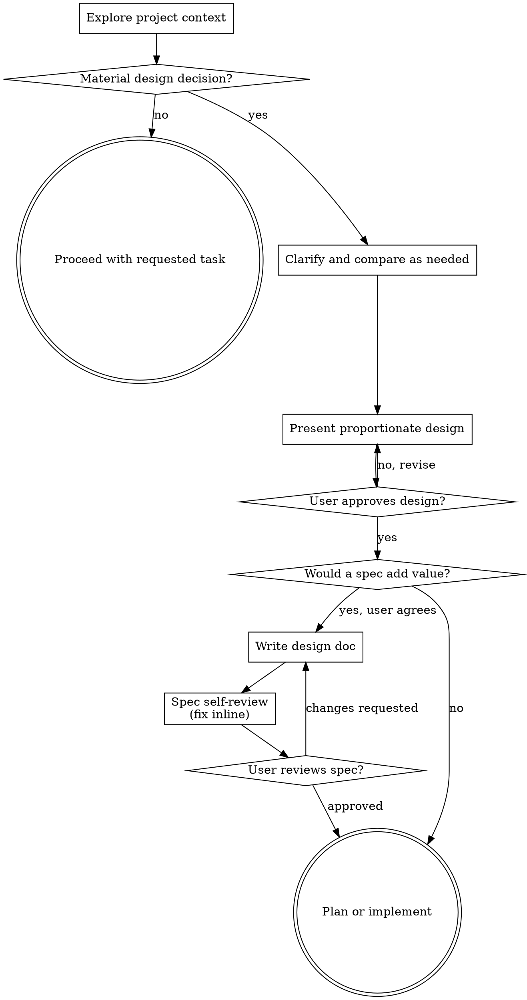

# Brainstorming Ideas Into Designs

Turn ambiguous ideas into clear designs and specs through natural collaborative dialogue.

Start by understanding the current project context and deciding whether any material design questions remain. Ask only the questions that can change the design. Once the design is clear, present it at a depth proportional to the change and get user approval.

<HARD-GATE>
Use this workflow only while material product, UX, architecture, API, data-model, scope, or trade-off decisions remain unresolved.

If repository evidence, an approved design, or explicit acceptance criteria already determine the expected behavior, exit this skill and proceed with the requested task without an additional design-approval gate.

Do not implement while a material design decision remains unresolved.
</HARD-GATE>

## Triage Before Brainstorming

Use the brainstorming workflow when either condition is true:

- The user explicitly asks to brainstorm, explore, compare, or design an idea.
- Reasonable implementations would differ materially in user-visible behavior, public interfaces, data models, architecture, scope, or long-term trade-offs, and existing context does not resolve the choice.

Exit the skill when the request is already well specified or only requires explanation, diagnosis, or a mechanical change. For bug reports, reproduce and diagnose the problem first. Brainstorm only if the intended behavior remains unclear after diagnosis.

Do not confuse code changes with design decisions. A small code diff can contain a material product decision; a large mechanical migration may contain none.

## Checklist

When brainstorming applies, track these items in order and skip conditional items that do not apply:

1. **Explore project context** — check files, docs, recent commits
2. **Confirm applicability** — exit if no material design decision remains
3. **Offer the visual companion just-in-time** — only when a question would genuinely be clearer shown than described; see the Visual Companion section below
4. **Ask necessary clarifying questions** — one at a time, focusing on answers that can change the design
5. **Compare genuine approaches when useful** — explain meaningful trade-offs and give a recommendation; do not invent alternatives to satisfy a quota
6. **Present the design** — scale it to the decision and get approval for material choices
7. **Offer to persist substantial designs** — ask whether to write a spec when a durable document would add value
8. **Write and self-review the spec (if requested)** — save to `docs/specs/YYYY-MM-DD-<topic>-design.md`, then check placeholders, contradictions, ambiguity, and scope
9. **Ask the user to review the written spec (if written)**
10. **Transition to the appropriate implementation or planning workflow**

## Process Flow

The terminal state is an approved design or a determination that no design work is needed. Use a planning skill when one is available and the task warrants a detailed plan; otherwise continue through the normal workflow requested by the user.

## The Process

**Understanding the idea:**

- Check out the current project state first (files, docs, recent commits)
- Before asking detailed questions, assess scope: if the request describes multiple independent subsystems (e.g., "build a platform with chat, file storage, billing, and analytics"), flag this immediately. Don't spend questions refining details of a project that needs to be decomposed first.
- If the project is too large for a single spec, help the user decompose into sub-projects: what are the independent pieces, how do they relate, what order should they be built? Then brainstorm the first sub-project through the normal design flow. Each sub-project gets its own spec → plan → implementation cycle.
- For appropriately-scoped projects, ask questions one at a time only when the answers can change the design
- Prefer multiple choice questions when possible, but open-ended is fine too
- Ask only one question per message; if a topic needs more exploration, break it into multiple questions
- Focus on understanding: purpose, constraints, success criteria

**Exploring approaches:**

- Compare 2-3 approaches only when they represent genuine choices
- For a straightforward decision with one clearly suitable approach, explain that approach and its main consequence without inventing alternatives
- Present options conversationally with your recommendation and reasoning
- Lead with your recommended option and explain why

**Presenting the design:**

- Once you believe you understand what you're building, present the design
- Scale the design to its complexity: a short paragraph for a small decision, structured sections for a substantial change
- Ask for one overall approval on small designs; validate substantial designs section by section when incremental feedback reduces rework
- Cover only relevant concerns, such as architecture, components, data flow, error handling, migration, and testing
- Be ready to go back and clarify if something doesn't make sense

**Design for isolation and clarity:**

- Break the system into smaller units that each have one clear purpose, communicate through well-defined interfaces, and can be understood and tested independently
- For each unit, you should be able to answer: what does it do, how do you use it, and what does it depend on?
- Can someone understand what a unit does without reading its internals? Can you change the internals without breaking consumers? If not, the boundaries need work.
- Smaller, well-bounded units are also easier for you to work with - you reason better about code you can hold in context at once, and your edits are more reliable when files are focused. When a file grows large, that's often a signal that it's doing too much.

**Working in existing codebases:**

- Explore the current structure before proposing changes. Follow existing patterns.
- Where existing code has problems that affect the work (e.g., a file that's grown too large, unclear boundaries, tangled responsibilities), include targeted improvements as part of the design - the way a good developer improves code they're working in.
- Don't propose unrelated refactoring. Stay focused on what serves the current goal.

## After the Design

**Documentation:**

- After the user approves a substantial design, ask whether they want it saved as a spec before creating any spec file
- For a small design, skip spec creation unless the user asks to preserve it
- If they decline, skip spec creation, self-review, and the written-spec review gate; proceed to the appropriate planning or implementation workflow
- If they accept, write the validated design (spec) to `docs/specs/YYYY-MM-DD-<topic>-design.md`
  - User preferences for spec location override this default
- Use elements-of-style:writing-clearly-and-concisely skill if available
- Do not create a git commit unless the user explicitly asks for one

**Spec Self-Review:**
After writing the spec document, look at it with fresh eyes:

1. **Placeholder scan:** Any "TBD", "TODO", incomplete sections, or vague requirements? Fix them.
2. **Internal consistency:** Do any sections contradict each other? Does the architecture match the feature descriptions?
3. **Scope check:** Is this focused enough for a single implementation plan, or does it need decomposition?
4. **Ambiguity check:** Could any requirement be interpreted two different ways? If so, pick one and make it explicit.

Fix any issues inline. No need to re-review — just fix and move on.

**User Review Gate:**
After the spec review loop passes, ask the user to review the written spec before proceeding:

> "Spec written to `<path>`. Please review it and let me know if you want any changes before we move to planning or implementation."

Wait for the user's response. If they request changes, make them and re-run the spec review loop. Only proceed once the user approves.

**Implementation:**

- Use a planning skill if one is available and the approved design needs a detailed implementation plan
- Otherwise proceed with the implementation workflow that matches the user's request

## Key Principles

- **Triage first** - Use brainstorming only for unresolved, material design decisions
- **One question at a time, when needed** - Don't ask questions that existing context already answers
- **Multiple choice preferred** - Easier to answer than open-ended when possible
- **YAGNI ruthlessly** - Remove unnecessary features from all designs
- **Explore real alternatives** - Compare options only when their trade-offs matter
- **Proportionate process** - Match the depth of design and approval to the uncertainty and impact
- **Incremental validation** - Get approval before implementing unresolved material decisions
- **Be flexible** - Go back and clarify when something doesn't make sense

## Visual Companion

A browser-based companion for showing mockups, diagrams, and visual options during brainstorming. Available as a tool — not a mode. Accepting the companion means it's available for questions that benefit from visual treatment; it does NOT mean every question goes through the browser.

**Offering the companion (just-in-time):** Do NOT offer it upfront. Wait until a question would genuinely be clearer shown than told — a real mockup / layout / diagram question, not merely a UI *topic*. The first time that happens, offer it then, as its own message:
> "This next part might be easier if I show you — I can put together mockups, diagrams, and comparisons in a browser tab as we go. It's still new and can be token-intensive. Want me to? I'll open it for you."

**This offer MUST be its own message.** Only the offer — no clarifying question, summary, or other content. Wait for the user's response. If they accept, start the server with `--open` so their browser opens to the first screen automatically. If they decline, continue text-only and don't offer again unless they raise it.

**Per-question decision:** Even after the user accepts, decide FOR EACH QUESTION whether to use the browser or the terminal. The test: **would the user understand this better by seeing it than reading it?**

- **Use the browser** for content that IS visual — mockups, wireframes, layout comparisons, architecture diagrams, side-by-side visual designs
- **Use the terminal** for content that is text — requirements questions, conceptual choices, tradeoff lists, A/B/C/D text options, scope decisions

A question about a UI topic is not automatically a visual question. "What does personality mean in this context?" is a conceptual question — use the terminal. "Which wizard layout works better?" is a visual question — use the browser.

If they agree to the companion, read the detailed guide before proceeding:
`skills/brainstorming/visual-companion.md`
